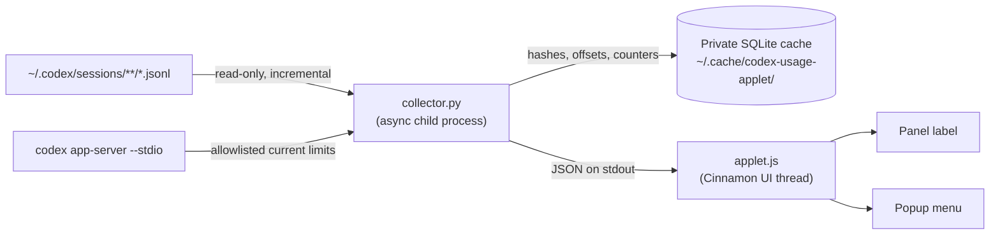

<div align="center">


# Codex Usage for Cinnamon

**A private, local panel applet that shows your Codex token usage and current account rate limits.**

*Built for Linux Mint / Cinnamon. Codex handles its own authenticated limit request. No credentials are read or stored by the applet.*


</div>


---

## Why this applet

OpenAI Codex does not ship a Linux desktop indicator, and the CLI has no offline `/status` command. This applet fills that gap by reading the session logs Codex already writes on your machine and rendering them in the Cinnamon panel.

- **Always visible** — rate-limit percentages or today's token count, right in the panel.
- **Detail on click** — a popup with limit progress bars, today/week/month totals, sessions, cache share, and the last observed model.
- **Private by design** — local JSONL provides token totals, while the installed Codex app-server provides current limits through its authenticated local protocol. The applet never reads or stores credentials, account IDs, or credit details.
- **Fast by design** — incremental reads with a private SQLite cache; unchanged history is never reparsed. Parsing runs in an async child process, so the panel never freezes.
- **Safe installer** — a plain symlink, idempotent, no `sudo`, and it refuses to overwrite another installation.
- **Zero dependencies** — Python 3 is the only runtime requirement; Node is used only for developer tests.

## Requirements

| Requirement | Notes |
|---|---|
| Cinnamon desktop | Tested on Linux Mint 22.3 / Cinnamon 6.6 |
| Python 3 | Standard library only, invoked as `python3` |
| Codex session logs | `~/.codex/sessions/**/*.jsonl` (written by the Codex CLI) |
| Codex CLI | Current account limits require `codex app-server`; JSONL snapshots are used if it is unavailable |
| Node.js | *Optional* — only for the JS unit tests |

## Installation

Clone the repository and run the installer from the checkout:

```sh
git clone https://github.com/Pilag6/codex-usage-applet.git
cd codex-usage-applet
./install.sh
```

The installer creates a development symlink:

```text
~/.local/share/cinnamon/applets/codex-usage@pila  →  <checkout>/src
```

Keep the checkout in place. The script is idempotent (safe to re-run) and exits with an error rather than overwriting any other installation. Works from bash and fish alike.

### Add it to the panel

1. Right-click the Cinnamon panel → **Applets**.
2. Find **Codex Usage** under *Installed applets*.
3. Select it and press **+**.
4. Right-click the applet icon → **Configure** to adjust settings.

### Uninstall

Remove the applet from the panel first, then run:

```sh
./uninstall.sh
```

Only this checkout's symlink is removed; your cache and preferences are kept.

## Configuration

Right-click the applet → **Configure**:

| Setting | Default | Range / options | Description |
|---|---|---|---|
| **Panel display** | Rate limits | `Rate limits`, `Daily tokens` | What the panel label shows. Applies immediately, without re-running the collector. |
| **Refresh interval** | 45 s | 30 – 3600 s | How often the collector runs. |
| **Mark limit snapshots stale after** | 300 s | 60 – 3600 s | Age after which limit values are flagged as stale. |

The popup always shows **both** limits and token statistics, regardless of the panel display mode.

> **Note on reloading:** Python changes are picked up through the symlink on the next refresh. Loaded JavaScript (and styles) are cached by Cinnamon — after editing `src/applet.js` or `src/stylesheet.css`, remove and re-add the applet, or restart Cinnamon (X11: `Alt+F2` → `r` → `Enter`; Wayland: log out and back in).

## What you see

### Panel

| Mode | Example | Meaning |
|---|---|---|
| Rate limits *(default)* | `5h 73% · W 41%` | Percentage **used** of the 5-hour and weekly windows |
| Rate limits (stale) | `5h 73%* · W 41%*` | Last observed, unexpired value is outdated or refresh failed |
| Rate limits (missing/expired) | `5h — · W —` | Current value is unavailable; expired percentages are never shown as current |
| Daily tokens | `1.84M today` | Local token total for today |
| Daily tokens (failed refresh) | `1.84M today*` | Cached statistics; the refresh did not succeed |

There is **no automatic fallback** between the two modes — you choose explicitly in settings.

### Popup (click the icon)

- **5-hour limit** and **weekly limit** — percentage used, a progress bar, and time until reset.
- **Limits observed** — when those snapshots were recorded.
- **Today** — input, cached input, output, reasoning output, total tokens, sessions, and cache share of input.
- **This week / This month** — total tokens on the local calendar (weeks start Monday).
- **Last model / Last reasoning effort** — from the most recent `turn_context` record.
- **Updated** — timestamp of the last successful collection.

Unexpired values marked `stale` keep their observation time visible. At a reset deadline the applet immediately hides the expired percentage and runs a refresh; it shows `—` until a current value is available rather than fabricating `0%`.

## How it works



1. `src/applet.js` schedules refreshes and launches `src/collector.py` via `Gio.Subprocess` — parsing never blocks the UI thread.
2. The collector scans `~/.codex/sessions/` and `~/.codex/archived_sessions/` (when present), seeking each file to its cached byte offset so only new data is read.
3. On every run, the collector asks the authenticated local Codex app-server for current limits with a bounded timeout. If that fails, it silently keeps the latest JSONL snapshot.
4. Deduplicated token events and allowlisted limit/model observations are stored in a mode-`700` cache directory with a mode-`600` database.
5. The collector prints a versioned JSON payload (`schema_version: 1`); the applet validates and renders it.

A second run without session changes reports `bytes_read: 0`.

## Data sources

Inspected local JSONL lines use a `timestamp`, optional `ordinal`, `type`, `payload` envelope:

| Record type | Used for |
|---|---|
| `token_usage_record` | Per-response `usage`, cumulative thread/turn usage, response/thread IDs. Unique response IDs deduplicate repeated events, copied sessions, and inherited history. |
| `event_msg` / `token_count` | Cumulative `info.total_token_usage`, last usage, and observed `rate_limits`. Both record types share a cumulative baseline; snapshots are differenced rather than summed. |
| `turn_context` | Last observed model and reasoning effort. |
| `session_meta` | Session identity, used internally only as a hash. |

Codex configuration and authentication files are **not** read by the collector. Authentication remains inside the Codex app-server process.

### Counting semantics

- **Total = input + output.** Cached input is a *subset* of input, and reasoning output is a *subset* of output — they are never added to the total again.
- **Cache share** = cached input ÷ input.
- **Sessions** = distinct threads with token activity in the selected period (including agent threads), not JSONL files or CLI invocations.
- Daily/weekly/monthly totals use the computer's **local calendar**; weeks start **Monday**.
- Usage is attributed to the timestamp of the reported response/snapshot, not the session start.
- The latest model/effort may come from a different thread than one you are running concurrently.

### Account limits

Observed snapshots include `used_percent`, `window_minutes`, and `resets_at`: a **300-minute** primary window and a **10,080-minute** secondary window. The applet reports **percentage used**, not remaining.

These are **account snapshots** reported by Codex — not limits recomputed from local token totals.

- Each collector run starts `codex app-server --stdio` briefly and requests `account/rateLimits/read`. Codex owns authentication and any network activity; the applet sends no credentials.
- Only the primary/secondary percentage, window duration, reset timestamp, and observation time are retained. Account IDs, credits, auth data, and raw responses are discarded.
- If Codex is missing, unauthenticated, times out, or returns an invalid response, the collector silently falls back to the latest JSONL snapshot. Expired fallback values display as unavailable.
- Usage from other devices is reflected in current account limits when Codex reports it, but not in local token statistics.
- Model-specific windows or unexpected durations are not presented as the standard account windows.

## Performance and privacy

**Incremental parsing.** The first run reads existing JSONL files; later runs `stat` the session tree, reopen only changed files, and seek to cached byte offsets. Directory/stat work scales with file count; aggregate queries scale with usage events in the current month.

**Privacy by construction.**

- Source files are opened **read-only**; nothing under `~/.codex` is modified or deleted.
- The cache stores only hashed identifiers, byte offsets, token counters, timestamps, and allowlisted model/limit metadata. It never stores the raw app-server response.
- File paths, prompts, responses, code, and credentials are **never** written to the cache or emitted as output.
- Cache directory is `700`, database file is `600`.
- On failure the collector prints only a generic error — exception details could leak paths or source content.

**Resilience.** Incomplete trailing lines are deferred; malformed and unexpected records are skipped. A truncated or replaced file is replayed with event-ID deduplication. Removed history remains in the statistical cache until you delete the cache to force a rebuild. Missing archived history cannot be reconstructed. This is a **local estimate, not a billing ledger**.

## Standalone CLI

The collector can be run outside Cinnamon; it prints statistical JSON only:

```sh
./scripts/codex-usage
```

```sh
# Isolated cache — never touches your default cache
./scripts/codex-usage --cache-dir /tmp/codex-usage-check

# Synthetic fixtures (for tests)
./scripts/codex-usage --codex-home /path/to/fixtures --cache-dir /tmp/fixtures-cache

# Custom staleness threshold
./scripts/codex-usage --stale-seconds 120
```

A cache is bound to one source directory: use a separate `--cache-dir` per `--codex-home`.

<details>
<summary>Example output (trimmed)</summary>

```json
{
  "schema_version": 1,
  "updated_at": 1790000000.0,
  "available": true,
  "warnings": 0,
  "bytes_read": 0,
  "today": {
    "input_tokens": 1200000,
    "cached_input_tokens": 900000,
    "cache_write_input_tokens": 0,
    "output_tokens": 640000,
    "reasoning_output_tokens": 180000,
    "total_tokens": 1840000,
    "sessions": 7,
    "cache_percent": 75.0
  },
  "week": { "total_tokens": 9200000, "sessions": 42, "cache_percent": 71.2 },
  "month": { "total_tokens": 31000000, "sessions": 180, "cache_percent": 69.4 },
  "limits": {
    "observed_at": 1789999800.0,
    "primary": { "used_percent": 73.0, "resets_at": 1790001000.0, "window_minutes": 300, "stale": false },
    "secondary": { "used_percent": 41.0, "resets_at": 1790500000.0, "window_minutes": 10080, "stale": false }
  },
  "context": { "observed_at": 1789999500.0, "model": "gpt-5-codex", "effort": "medium" }
}
```

</details>

## Development

### Run the tests

```sh
python3 -m unittest discover -s tests -v   # collector unit tests
node --check src/applet.js                 # applet syntax check
node tests/test_applet.js                  # mock UI tests
```

Synthetic tests never require real conversations and never modify Codex files. Python 3 is required at runtime; Node is only used for these developer checks.

### Debug

If Cinnamon reports an error:

1. Open **Looking Glass**: `Alt+F2` → `lg` → **Log**.
2. Or inspect the user journal: `journalctl --user -b`.
3. Confirm the development symlink points to this checkout, `python3` is on `PATH`, and `./scripts/codex-usage` succeeds.
4. Remove/re-add the applet after JavaScript changes.

<details>
<summary>Validated during development</summary>

- Collector totals matched unique-response usage from actual local files exactly.
- Async subprocess exercised under the installed CJS loader.
- Installer idempotence and refusal to overwrite unrelated directories.
- Full visual validation requires adding the applet to the panel.

</details>

### Project layout

```text
codex-usage-applet/
├── src/
│   ├── applet.js            # Native Cinnamon UI and async lifecycle
│   ├── collector.py         # Incremental, read-only Python collector
│   ├── metadata.json        # Cinnamon applet manifest (uuid, version)
│   ├── settings-schema.json # Settings exposed in Configure
│   ├── stylesheet.css       # Panel and popup styling
│   └── icons/               # Symbolic panel icon
├── scripts/
│   └── codex-usage          # Standalone collector entry point
├── tests/
│   ├── test_collector.py    # Python unit tests
│   └── test_applet.js       # Node mock UI tests
├── assets/                  # README artwork
├── install.sh               # Non-destructive symlink install
└── uninstall.sh             # Non-destructive symlink removal
```

## Reporting bugs

Please include your Cinnamon version, the output of `./scripts/codex-usage` (which contains only statistics), and relevant log lines.

> **Never post your Codex session files or authentication data in an issue.** The collector intentionally emits only a generic error if cache access fails — keep it that way when pasting output manually.

## Disclaimer

This is an independent, community project. It is not affiliated with, endorsed by, or supported by OpenAI. "Codex" and the Codex logo are trademarks of OpenAI.
